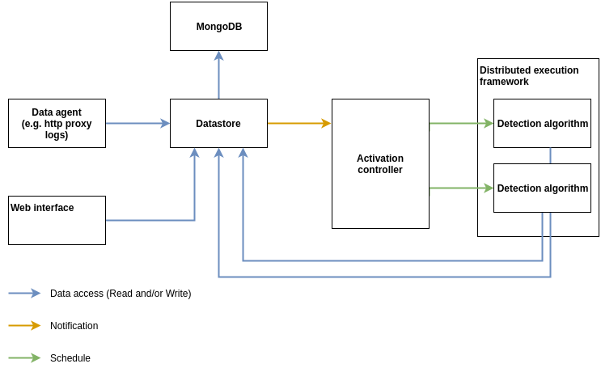
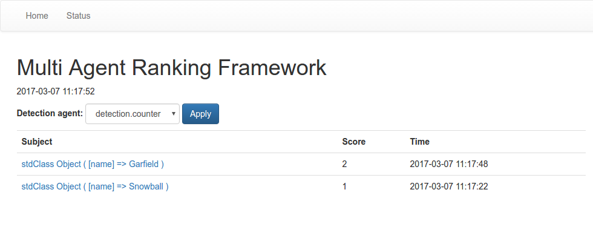
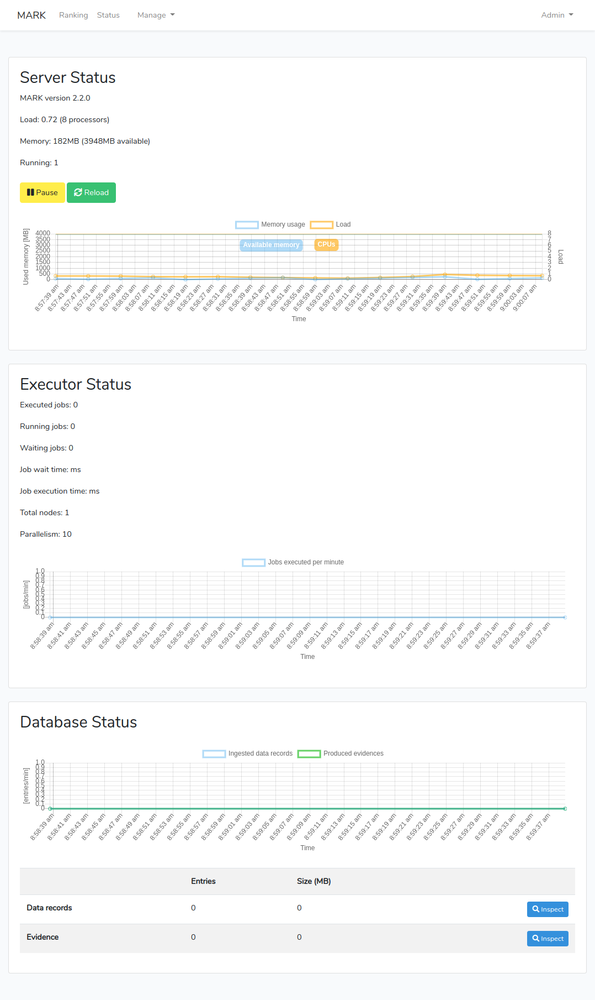

# MARK - Easy BigData Ranking

Developement now takes place at https://gitlab.cylab.be/cylab/mark

The **multi-agent ranking framework (MARK)** aims to provide all the building blocks that are required to build large scale **detection and ranking systems**. Namely, the framework provides the following key components: 

* a **distributed storage** suited for very large datasets and BigData applications, 
* a **web based visualization and management interface**,
* a distributed **execution framework** to reliably execute the detection algorithms and balance the compute load between multiple servers,
* and an easy to configure **triggering mechanism** that allows to execute the detection algorithms when new data is available or when configured conditions are met.

All these components are implemented in a generic way. They are independent of the type of data that will be processed by the framework. This allows the data scientist to focus on his core business: **developing effective detection algorithms**.

## Requirements

* Oracle Java 8 or up
* MongoDB

## Getting started

To get started with installation and to implement your own detection algorithms, check our [tutorial](./TUTORIAL.md)
