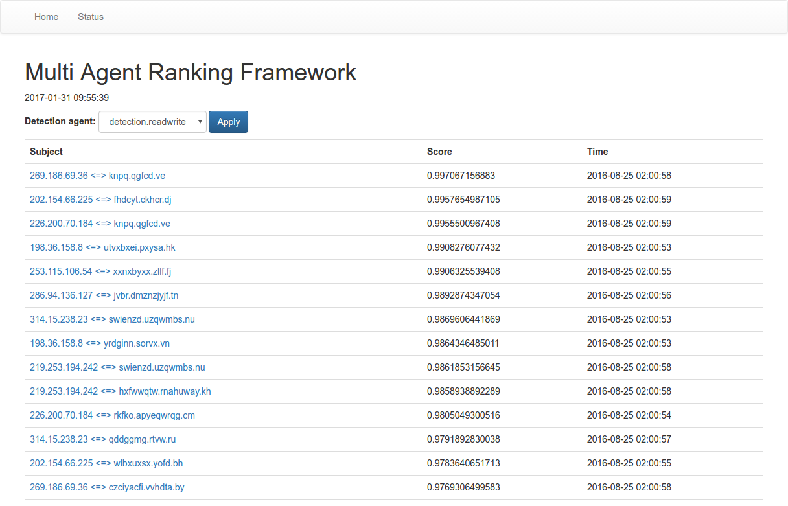
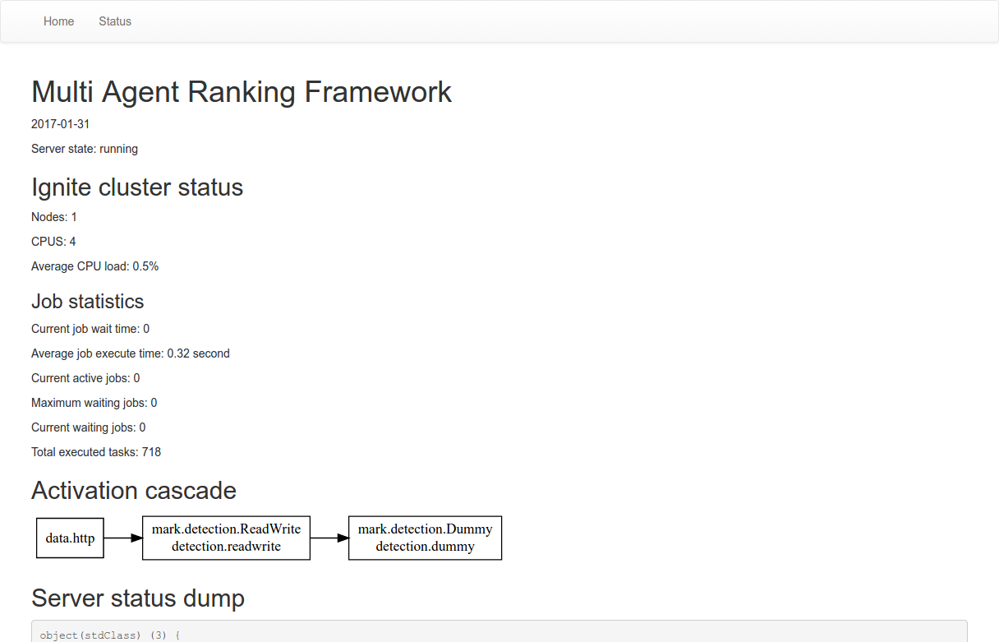
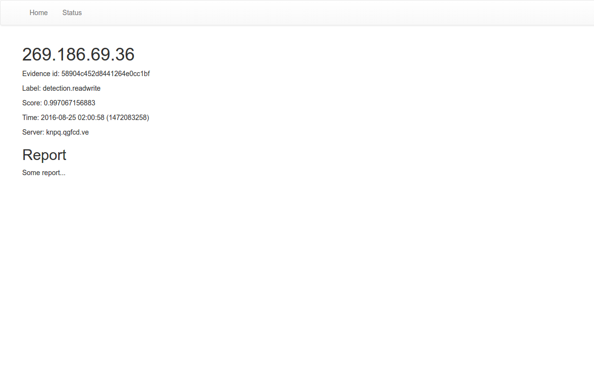

# MARK

BigData ranking, made easy!

The **Multi Agent Ranking Framework** allows to easily implement large scale detection and ranking systems. It provides you with all necessary storage, visualization and activation mechanisms, such that you can focus on the real important stuff: detection algorithms.

## Getting started

To get started with installation and to implement your own detection algorithms, check our [tutorial](./TUTORIAL.md)
